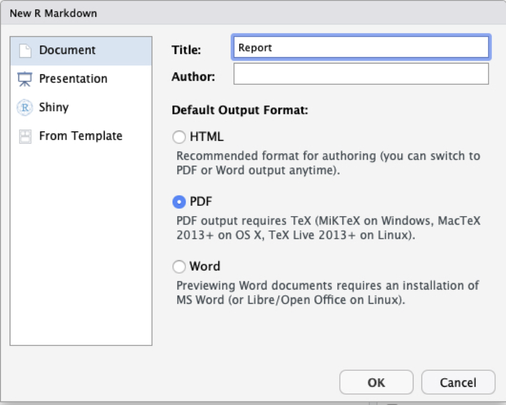
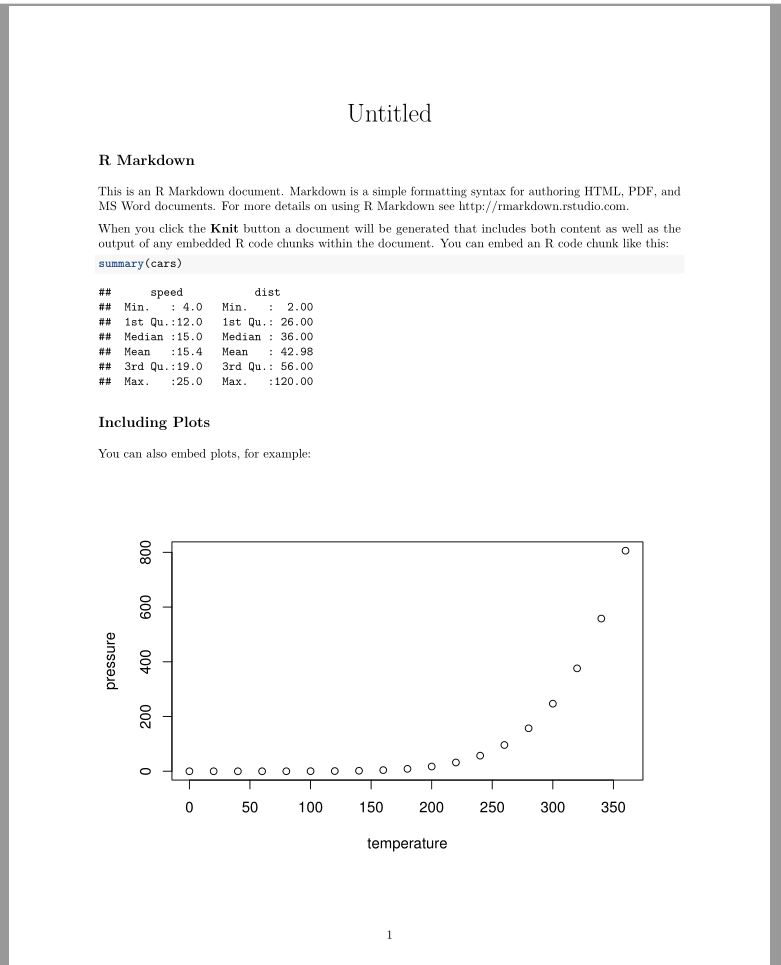

# Creating a new R Markdown document from scratch {-}

If you want to create a new R Markdown document from scratch within RStudio you can go to:

`File -> New File -> R Markdown...`

This will open the following window within RStudio:

```{r markdown, echo=FALSE, out.width = '60%', fig.align='center'}

```

From here select **Document** and the **Default Output Format** as **PDF**. Name your document `Week3DA` and select OK. This will open within RStudio a `.Rmd` file containing simple instructions on how to do some basic stuff using R Markdown. To see what the PDF of the default document looks like click on the `Knit` button at the top of the document window. A screen will appear showing the newly created `.pdf` document, the first page of which looks like this:

```{r markdownpage1, echo=FALSE, out.width = '40%', fig.align='center'}

```

The tasks in this weeks tutorial require you to modify this default document by coping over the code in the following sections and compiling and viewing the `.pdf` file each time.

***

**Further information**: Additional information on getting started with Markdown can be found [here](https://rmarkdown.rstudio.com/lesson-1.html). 

<br>
<br>

