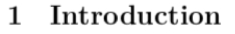
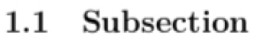

# Sections {-}

Sections within an R Markdown document are created using `#`. For example, `# Introduction` will create a section titled **Introduction** with automatic numbering, i.e.

```{r intro, echo=FALSE, out.width = '20%', fig.align='left'}

```

**Note**: the section is numbered as we have set `number_sections: yes` within the preamble of the document. If you do not wish to have numbered sections, then set `number_sections: no` in the preamble. I would recommend using numbered sections as it makes it easier to refer to them within the text. 

Each section can be assigned labels so that they can be referred to within the text. For example, to give our **Introduction** section a label we simply add the label `{#sec:intro}` to the section title as follows:

```
# Introduction {#sec:intro}
```

where `sec:intro` is the name chosen for this particular section. It is a good idea to label your sections appropriately so that it is easy to refer to them later. The section can now be referred to within the text of the document using the `\ref` command. That is

```
Section \ref{sec:intro} ...
```
will produce

```
Section 1 ...
```

where the 1 is a clickable hyperlink that will take you to the beginning of that section within the document.

## Subsections {-}

Subsections can be added to a document in a similar fashion using `##` such that `## Subsection {#sec:sub}` will create a subsection with the label `sec:sub` and title **Subsection**:

```{r subsec, echo=FALSE, out.width = '20%', fig.align='left'}

```

<br>

**Task**
Create some suitable subsections in your document by copying and modifying the above code into `Week3DA.Rmd`. `Knit` the `.Rmd` file and notice what is produced in the `Week3DA.pdf` file.

<br>
<br>

